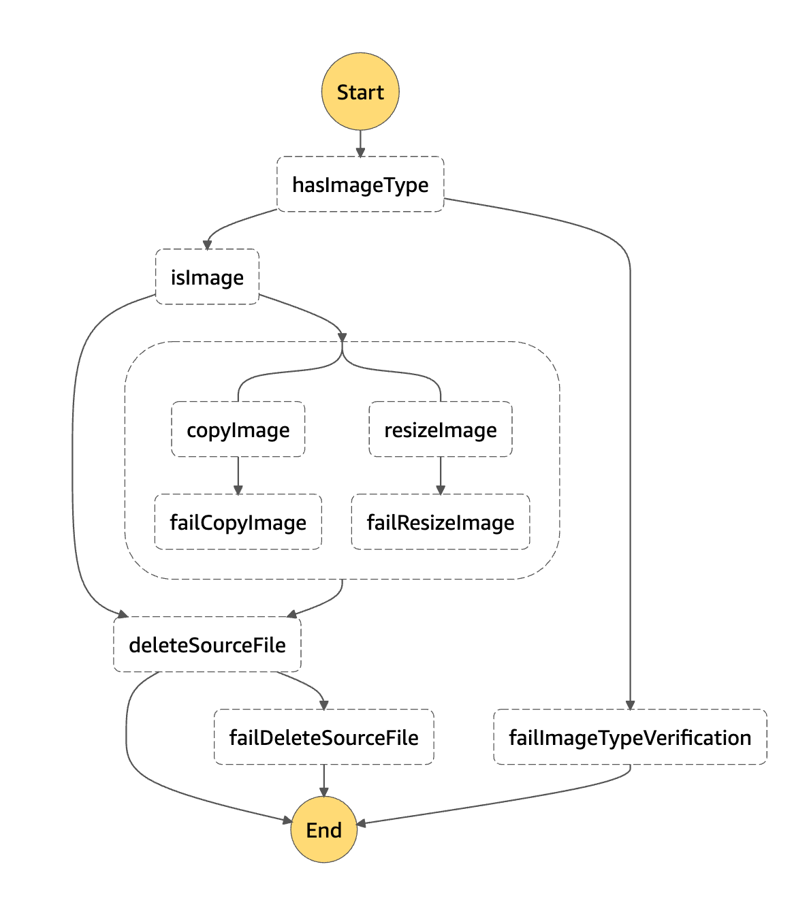

# Serverless Uploader

An application which provides functionality to upload an images, with their labels and a notes.
Its backend is built on `AWS Lambda`, `API Gateway`, `S3`, `DynamoDB`, and `State Machine`.

Backed is based on the `AWS Lambda` and `State Machines`:

`State Machine`

